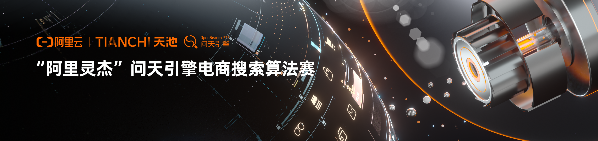

# 电商搜索召回



一个毫无 NLP 经验的人的比赛（挖坑填坑）之旅。https://muyuuuu.github.io/2022/03/24/E-commerce-Search-Recall/

1. 实现 DSSM baseline，直接优化距离结果很差，得分 0.057
2. 实现 CoSENT，余弦距离得分 0.159
3. 实现 SimCSE，得分 0.227

tools 里面是精度转换和结果文件检查。

## Trick

在 model.py 中使用 first-last-avg 融合大概从 0.22 提升到 0.245 左右，调参好一些能到 0.25。

```py
def forward(self, input_ids, attention_mask, token_type_ids):
    out = self.extractor(input_ids,
                         attention_mask=attention_mask,
                         token_type_ids=token_type_ids,
                         output_hidden_states=True)

    first = out.hidden_states[1].transpose(1, 2)
    last = out.hidden_states[-1].transpose(1, 2)
    first_avg = torch.avg_pool1d(
        first, kernel_size=last.shape[-1]).squeeze(-1)  # [batch, 768]
    last_avg = torch.avg_pool1d(last, kernel_size=last.shape[-1]).squeeze(
        -1)  # [batch, 768]
    avg = torch.cat((first_avg.unsqueeze(1), last_avg.unsqueeze(1)),
                    dim=1)  # [batch, 2, 768]
    out = torch.avg_pool1d(avg.transpose(1, 2), kernel_size=2).squeeze(-1)
    x = self.fc(out)
    x = F.normalize(x, p=2, dim=-1)
    return x
 ```

# 参考

- [CoSENT 实现](https://github.com/shawroad/CoSENT_Pytorch)
- [SimCSE 实现](https://github.com/zhengyanzhao1997/NLP-model/tree/main/model/model/Torch_model/SimCSE-Chinese)
